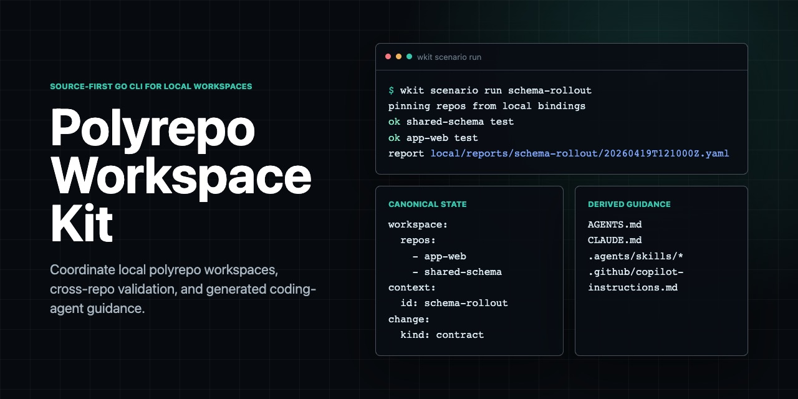

# Polyrepo Workspace Kit

[](https://github.com/johnkil/polyrepo-workspace-kit/actions/workflows/test.yml)
[](https://pkg.go.dev/github.com/johnkil/polyrepo-workspace-kit)
[](https://github.com/johnkil/polyrepo-workspace-kit/releases)
[](LICENSE)

**A local CLI for polyrepo and multi-repository workspace coordination, cross-repo validation, and generated AI coding-agent guidance.**



- Repository name: `polyrepo-workspace-kit`
- Go module: `github.com/johnkil/polyrepo-workspace-kit`
- CLI: `wkit`
- Current status: v0.x CLI implementation with release archive install, source install, and tagged release automation

Polyrepo Workspace Kit helps teams coordinate repeated work across many repositories without pretending a polyrepo is a monorepo and without turning tool-specific agent files into the source of truth. It gives humans and coding agents one local workspace model for repository relationships, live changes, validation scenarios, local checkout bindings, and derived guidance files such as `AGENTS.md`, `CLAUDE.md`, `.agents/skills/*`, and Copilot instructions.

This repository currently contains the product baseline, technical specification, proof plan, research base, and the current Go implementation for `wkit`. The implemented CLI surface currently covers workspace initialization, repo registration, local bindings, context orientation, workspace overview/status/doctor diagnostics, change creation/showing, scenario pin/status/run, portable install, repo-scope tool adapters, validation, and version reporting. Tool-specific user-scope installs, Homebrew packaging, and signed/notarized binaries remain planned.

Use it when you need to:

- describe a local multi-repo workspace explicitly;
- coordinate contract changes, rollout order, or shared-schema work across repositories;
- pin a reviewable cross-repo validation snapshot before handoff;
- run repo-local checks through declared entrypoints without centralizing arbitrary commands;
- generate repo-scope coding-agent guidance for Codex, OpenCode, GitHub Copilot, Claude, or portable `AGENTS.md` consumers.

## Quick Start

Install a prebuilt binary on macOS or Linux:

```bash
curl -fsSL https://raw.githubusercontent.com/johnkil/polyrepo-workspace-kit/main/install.sh | sh
```

The installer downloads the latest GitHub Release archive, verifies
`checksums.txt`, and installs `wkit` into the first writable directory already
on `PATH`. If no writable `PATH` directory exists, install into a system path
without editing shell startup files:

```bash
curl -fsSL -o /tmp/wkit-install.sh https://raw.githubusercontent.com/johnkil/polyrepo-workspace-kit/main/install.sh
sudo WKIT_INSTALL_DIR=/usr/local/bin sh /tmp/wkit-install.sh
```

Install from source with Go:

```bash
go install github.com/johnkil/polyrepo-workspace-kit/cmd/wkit@latest
```

Tagged releases also provide prebuilt archives and `checksums.txt` on the [GitHub Releases page](https://github.com/johnkil/polyrepo-workspace-kit/releases).

From a local checkout:

```bash
make tools
make check
go run ./cmd/wkit --help
```

Run the minimal polyrepo workspace demo:

```bash
make demo
```

Build a local `wkit` binary:

```bash
make build
```

## Product Thesis

The durable opportunity is not "generate more agent files."

The durable opportunity is to help humans and agents answer:

- which repositories belong to this workspace;
- how those repositories relate;
- which repositories matter for a task or live change;
- what local checks provide reviewable evidence for that change;
- which generated agent files came from canonical workspace context.

The strongest wedge is therefore:

**cross-repo coordination and scenario validation in a local multi-repo workspace.**

## Layers

The project has four layers.

### 1. Core Workspace

The core is the canonical coordination model.

- `workspace` - shared coordination boundary
- `repo` - known repository descriptor
- `relation` - directional cross-repo link
- `rule` - coordination constraint such as rollout order
- `context` - named lookup boundary
- `change` - live cross-repo coordination object
- `scenario` - reviewable local validation snapshot
- `binding` - local checkout path for a repo id
- `entrypoint` - repo-local executable truth, such as `test`

### 2. Portable Guidance

Portable guidance is intentionally narrow.

- `guidance/rules/*` - short always-on agent guidance
- `guidance/skills/*/SKILL.md` - reusable skill-style workflows

Portable outputs are derived artifacts:

- `AGENTS.md`
- `.agents/skills/*`

### 3. Adapters

Adapters install derived guidance into real tool discovery scopes. Adapter outputs are not canonical truth.

Initial v0.x target surface:

- `portable`
  - repo scope: `AGENTS.md`, `.agents/skills/*`
  - user scope: `.agents/skills/*`
- `codex`
  - repo scope: same as portable
- `opencode`
  - repo scope: same as portable
- `copilot`
  - repo scope: `.github/copilot-instructions.md`
- `claude`
  - repo scope: `CLAUDE.md`, `.claude/skills/*`

These targets are docs-backed until compatibility probes record tool version, probe date, target path, and observed behavior. Tool-specific user-scope targets for Codex, OpenCode, Copilot, and Claude remain candidate/unverified until empirical compatibility passes validate them.

### 4. Packs

Packs are a future distribution layer for reusable installs, plugins, or MCP-heavy bundles.

They are deferred for v0.x and are not part of the canonical workspace model.

## What This Is Not

This project is not:

- a monorepo manager;
- a build graph or distributed task execution platform;
- a developer portal or software catalog;
- a retrieval engine or code graph system;
- an AI IDE;
- a universal custom-agent or subagent schema;
- a universal command abstraction framework;
- a plugin marketplace;
- a hosted policy system;
- a long-term project-memory platform.

## State Model

The planned v0.x workspace layout is:

```text
workspace/
  coordination/
    workspace.yaml
    contexts.yaml
    changes/
    scenarios/
      <scenario-id>/
        manifest.lock.yaml
    rules/
  guidance/
    rules/
      always-on.md
    skills/
      <skill-name>/
        SKILL.md
  repos/
    <repo-id>/
      repo.yaml
  local/
    bindings.yaml
    reports/
      <scenario-id>/
        <run-id>.yaml
  runtime/
  config/
  bin/
```

State classes:

- Canonical shared state: `coordination/*`, `repos/*/repo.yaml`, `guidance/rules/*`, `guidance/skills/*`
- Canonical machine-local state: `local/bindings.yaml`
- Derived state: scenario run reports and adapter outputs

## Scenario Semantics

For v0.x, a `scenario` is a **reviewable local validation snapshot**, not a full environment reproduction artifact.

It is intended to support:

- pinned local review;
- bounded drift detection;
- normalized execution of repo-local entrypoints;
- handoff and evidence.

It does not claim:

- complete dependency replay;
- machine-independent environment reproduction;
- CI-level orchestration.

Fields such as `env_profile` and `env_requirements` are descriptive metadata in v0.x. They do not imply automatic environment loading, secret loading, shell activation, or toolchain management.

Scenario runs write derived evidence under `local/reports/*`, including a structured YAML report and a text summary for quick review.

## CLI Contract

The first implementation slice is backed by the Go CLI in `cmd/wkit`.

Local development:

```bash
make tools
make check
go run ./cmd/wkit --help
```

`make tools` installs `goimports`, `govulncheck`, and the pinned `golangci-lint` version from `.golangci-lint-version`.
`make check` also runs the Go race detector and `govulncheck`.

Build a local binary:

```bash
make build
```

Run the minimal example:

```bash
make demo
```

Implemented commands:

```bash
wkit init <path>
wkit repo register <repo-id> --kind <kind>
wkit bind set <repo-id> <path>
wkit context list
wkit context show <context-id>
wkit info
wkit overview
wkit status [--context <context-id>]
wkit doctor
wkit validate
wkit version
wkit --version
wkit change new <context> --title <title>
wkit change show <change-id>
wkit scenario pin <scenario-id> --change <change-id>
wkit scenario show <scenario-id>
wkit scenario status <scenario-id>
wkit scenario run <scenario-id>
```

Orientation and diagnostic commands are read-only. `wkit status`, `wkit doctor`, and `wkit scenario status` do not run remote fetches, do not execute scenario checks, and do not mutate local checkouts.

Implemented install commands:

```bash
wkit install show-targets <tool> [repo-id]
wkit install plan <tool> [repo-id]
wkit install diff <tool> [repo-id]
wkit install apply <tool> [repo-id]
```

Supported tools:

- `portable`
- `codex`
- `opencode`
- `copilot`
- `claude`

Tool-specific user-scope installs remain candidate/unverified and are intentionally not implemented.

Install safety is part of the product contract:

- plan before writing;
- target inspection;
- textual diff;
- confirmation;
- `--dry-run`;
- `--force`;
- `--backup`;
- conservative handling of unmarked existing files.

## Proof Plan

The project should be called MVP-proven only when:

- 2 independent pilots are completed;
- 3-5 measured workflows are captured;
- 1 cold-start onboarding succeeds;
- 1 compatibility pass is completed for each non-portable tool adapter;
- 1 portable output smoke test is completed for `AGENTS.md` and `.agents/skills/*`;
- at least 1 non-author pilot participant says keeping the manifests current is worth the coordination savings;
- the core workflow remains useful even when adapter install is not the primary user value;
- no new canonical entities are added during the proof window.

## Documentation

Core docs:

- [Product Requirements](docs/prd.md)
- [RFC: Core Model and Layering](docs/rfc.md)
- [Technical Specification](docs/spec.md)
- [Proof and Pilot Plan](docs/plan.md)
- [Implementation Plan](docs/implementation-plan.md)
- [Install and Development](docs/install.md)
- [Release and Versioning](docs/release.md)
- [Release Notes](docs/release-notes.md)
- [ADR 0001: CLI Tech Stack](docs/adr/0001-tech-stack.md)

Research base:

- [Research Index](research/README.md)
- [Market Research](research/market.md)
- [Competitive Research](research/competitors.md)
- [Agent Standards Research](research/agent-standards.md)
- [Technical Options Research](research/tech-options.md)
- [GitHub / Kiro / Sourcegraph Precedents](research/precedents-github-kiro-sourcegraph.md)
- [agents.ge Teardown](research/agents-ge-teardown.md)
- [Empirical Agent Compatibility Matrix](research/empirical-agent-compatibility-matrix.md)
- [Primary Research Plan](research/primary-research-plan.md)

Examples:

- [Minimal Workspace Example](examples/minimal-workspace/README.md)
- [Minimal Scenario Artifact Snapshot](examples/minimal-workspace/artifacts/README.md)

Community and project operations:

- [Contributing](CONTRIBUTING.md)
- [Security Policy](SECURITY.md)
- [Support](SUPPORT.md)
- [Code of Conduct](CODE_OF_CONDUCT.md)
- [Changelog](CHANGELOG.md)

## License

Polyrepo Workspace Kit is licensed under the [Apache License 2.0](LICENSE).

## Compatibility Notes

Adapter compatibility claims are versioned observations, not timeless guarantees. Current empirical notes are recorded in [Empirical Agent Compatibility Matrix](research/empirical-agent-compatibility-matrix.md).
